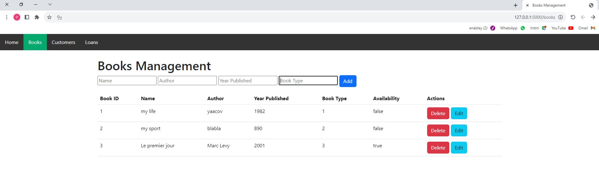
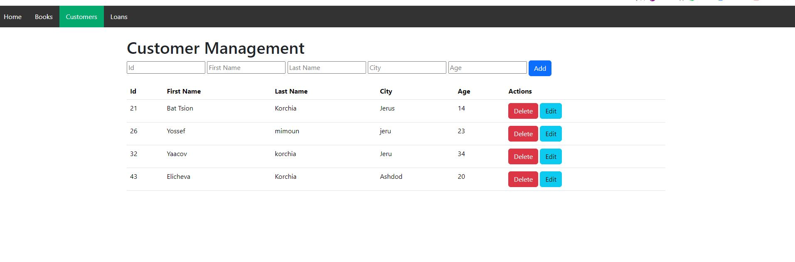
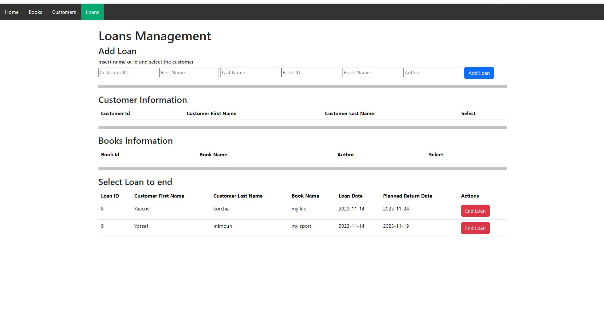

<head>
  <!-- Other head elements -->
  <script src="https://cdnjs.cloudflare.com/ajax/libs/clipboard.js/2.0.8/clipboard.min.js"></script>
</head>

# Overview
The Library Project is a web application that leverages Flask and flask_sqlalchemy to facilitate library management tasks, including borrowing and returning books, adding and removing book entries, as well as managing a list of customers.

## Features

- **Book Management:**
  <div style="margin-left: 20px;">
    - Add new books to the library <br>
    - Remove books from the library <br>
    - Update book details <br>
  </div>

- **Customer Management:**
  <div style="margin-left: 20px;">
    - Add customer to the list <br>
    - Remove customer from the list <br>
    - Update customer details <br>

  </div>
- **Loan Management:**
  <div style="margin-left: 20px;">
    - Loan a book for a customer <br>
    - Return a loan <br>
  </div>

# Prerequisites
In order to locally run the website, you need to install this following:
* Python (from version 3.7)
* Flask
* SQLAchemy

For this purpose, after you download the repository by following command:
<div>
```bash
git clone https://github.com/yaacovk10/Library_project_new.git
```
<button class="copy-button" data-clipboard-target="#clone-command">Copy</button>
</div>

you can install all the requirements by following:
<div>
```bash
pip install -r requirements.txt
```
<button class="copy-button" data-clipboard-target="#clone-command">Copy</button>
</div>


# Web appearance

* To add a new book, in first line fill the text boxes. Make attention to fill all the fields, and to insert valid information in "Year Published" text box (only integers), and in Book type (only : 1 , 2 or 3)
* To remove a book, click on Delete button near the specific book.
- **To update a book information**
<div style="margin-left: 20px;">
  - click on Edit button near the book information. <br>
  - Edit button will be changed to Update button, and book information will be editable. <br>
  - Insert the updated information. <br>
  - click again on Update that will remain to Edit.<br>
</div>
<br> <br>


* To add a new customer, in first line fill the text boxes. Make attention to fill all the fields, and to insert valid information in "Id" and "Age" text box (only integers)
* To remove a customer, click on Delete button near the specific customer.
- **To update a customer information**
<div style="margin-left: 20px;">
  - click on Edit button near the book information. <br>
  - Edit button will be changed to Update button, and book information will be editable. <br>
  - Insert the updated information. <br>
  - click again on Update that will remain to Edit.<br>
</div>
<br> <br>


* To  add a new loan, insert customer information and book information in the first line
<div style="margin-left: 20px;">
- Loan will be possible only if the book is available </br>
- To search the customer, insert one of customer field, and matching customers will appears in section Customer information. At line end, a Select button allow you to fill information in first line
- To search the book, insert one of book field, and matching books will appears in section Book information. At line end, a Select button allow you to fill information in first line
- After all the fields are filled you can click on Add Loan
</div>

* To end a loan, Click on End Loan on selected line

